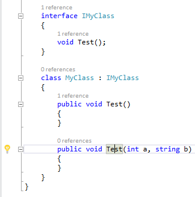
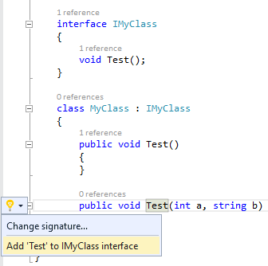
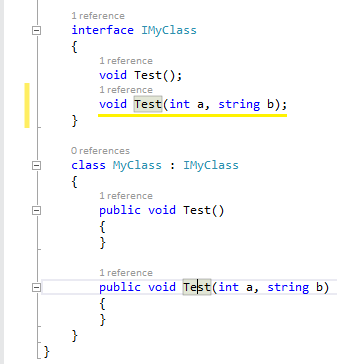

From: https://marketplace.visualstudio.com/items?itemName=LeonGitis.Addtointerface

"Add to interface" extension allows to simplify SOLID development by reducing the places for adding new functions. It works similar to "Extract Interface" command from class refactoring menu, but can be applied on single method.

Steps:

1) A new method is added to 'MyClass' class.

2) A light bulb with suggestions is displayed on method selection.\

3) By clicking on the light bulb, concrete suggestion is displayed: Add 'Test' to IMyClass interface.\

4) A new method is created in the IMyClass interface.\

